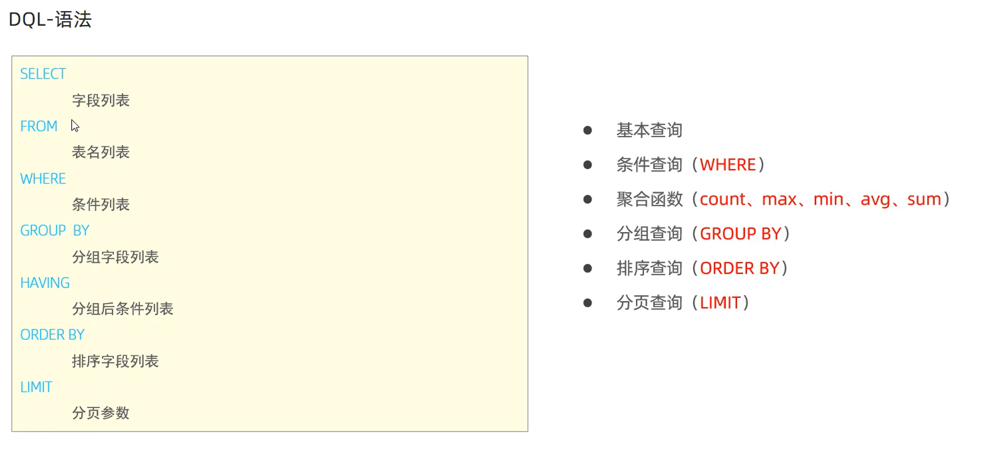

# SQL

## SQL分类

-   DDL （Data Definiton Language） 数据定义语言，用来定义数据库对象（数据库，表，字段）
-   DML （Data Manipulation Language） 数据库操作语言，用来对数据库表中的数据进行增删改
-   DQL （Data Query Language） 数据查询语言，用来查询数据库中表的记录
-   DCL （Data Control Language） 数据控制语言，用来创建数据库用户、控制数据库的访问权限

### DDL

#### 数据库操作
-   查询所有数据库：`show databases`
-    查询当前数据库：`select database()`
-   创建数据库：`create database [if not exists] 数据库名 [default charset 字符集] [collate 排序规则]`
-    删除数据库：`drop database [if exists] 数据库名`
-    使用/切换数据库：`use 数据库名`

创建test数据库并指定字符集，如果不存在就执行：`creat database if not exists test default charset utf8mb4`
删除test数据库，如果存在就执行：`drop database if exists test`

#### 表查询

-   查询当前数据库所有表：`show tables`
-   查询表结构：`desc 表名`
-   查询指定表的建表语句：`show create table 表名` 

#### 表创建

```sql
创建表：create table 表名 (字段1 字段1类型 [comment 字段1注释],
					    字段2 字段2类型 [comment 字段2注释],
					    ......
					    字段n 字段n类型 [comment 字段n注释]
					    ) [comment 表注释]
注意：[]表示可选，最后一个字段后面没有逗号
```
#### 表数据类型

##### 数值类型


##### 字符串类型


##### 日期类型


#### 表修改

-   添加字段：`alter table 表名 add 字段名 类型（长度） [comment 注释] [约束]` 
-   修改字段名和字段类型：`alter table 表名 modify 字段名 新数据类型（长度）` 
-   删除字段：`alter table 表名 drop 字段名` 
-   修改表名：`alter table 表名 rename to 新表名` 
-   删除表：`drop table [if exists] 表名`
-   删除指定表，并重新创建该表：`truncate table 表名` 

### DML

#### 插入数据`INSERT`

-   给指定字段添加数据：`insert into 表名 （字段名1, 字段名2,...）`
-   给全部字段添加数据：`insert into 表名 values （值1, 值2,...）`
-   批量添加数据：

 ```sql
 insert into 表名 （字段名1, 字段名2,...） values （值1, 值2...）,（值1, 值2...）
 insert into 表名 values （值1, 值2...）,（值1, 值2...）
 ```

注意：字符串和日期类型数据应包含在引号中，数据的大小应在字段规定范围，字段和值的顺序是对应的

#### 更新数据`UPDATE`

修改数据：`update 表名 set 字段名1=值1, 字段名2=值2,...[where 条件]` 

注意：如果没有指定条件，将修改整张表的所有数据。

#### 删除数据`DELETE`

删除数据：`delete from 表名 [where 条件]`

注意：如果没有指定条件，将删除整张表的所有数据。delete语句会删除一整行数据，delete语句不能删除某个字段的值（可用update修改为none)。

### DQL



#### 基本查询


